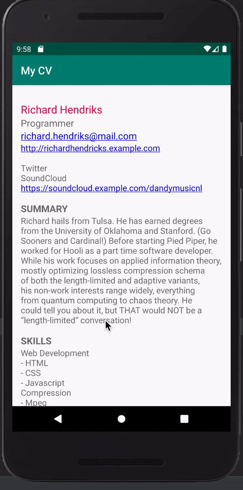

# MyCV

# MyCVApp

A native Android app to display CV. The app is built in Kotlin.

## Architecture Diagram

## Why MVVM?
1. Maintainability
2. Testability
3. Extensibility

The app has following packages:

app: It contains all the base classes.

data: It contains all the data accessing and manipulating components.

di: Dependency providing classes using Dagger2.

rx: It contains classes related to RxJava.

ui: View classes along with their corresponding ViewModel & use cases.

utils: Utility classes.

Classes have been designed in such a way that it could be inherited and maximize the code reuse.

## Why Reactive Extensions (Rx)?
Reactive Extensions makes asynchronous programming easy with observable streams especially event driven programs like Android app.

## Testing

### Unit Tests
- JUnit tests for testing ViewModel, repository, use cases

### Mocking
- Fake data source implementation for easy UI testing using stubbed data

### UI Tests (Espresso)
- [Espresso](https://developer.android.com/training/testing/espresso/) tests for testing UI using
- Capture UI Test Screenshots

